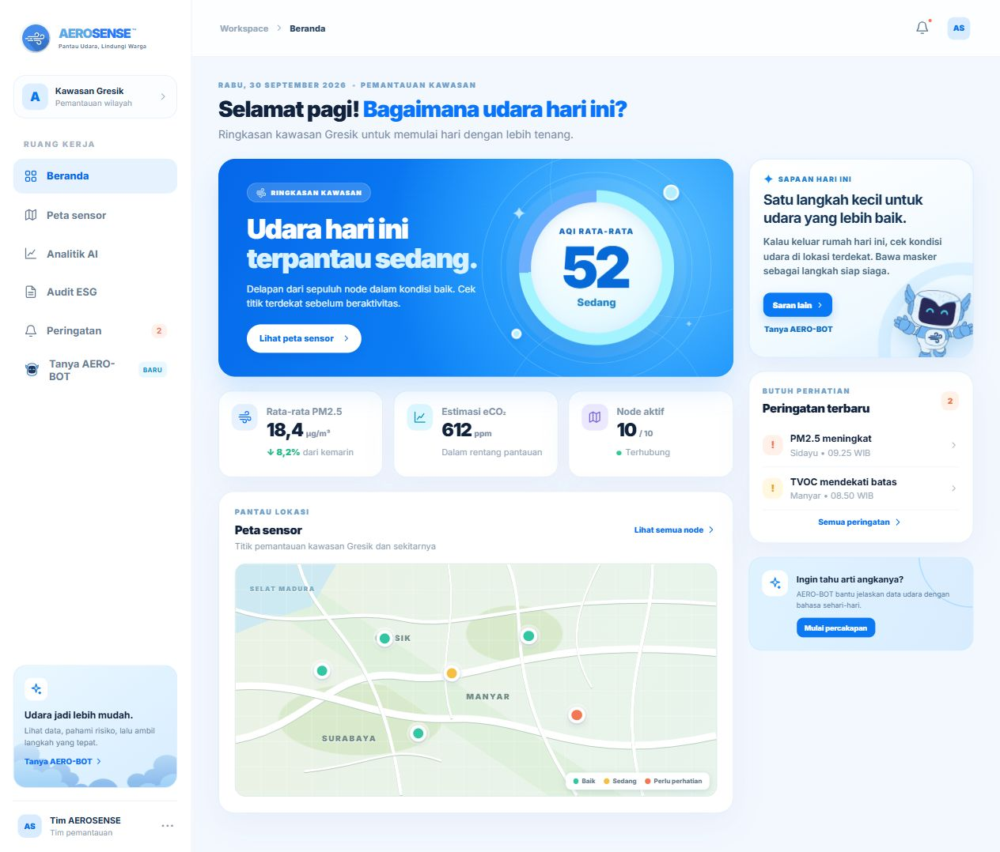
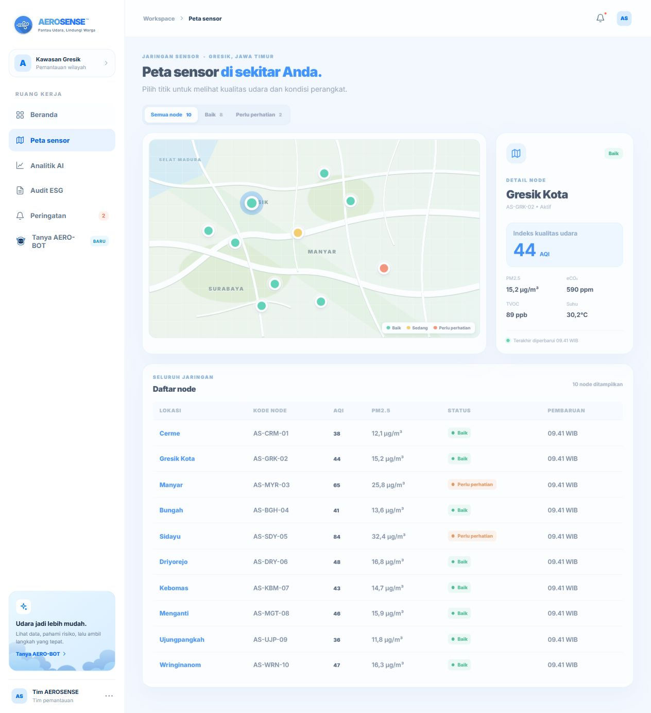
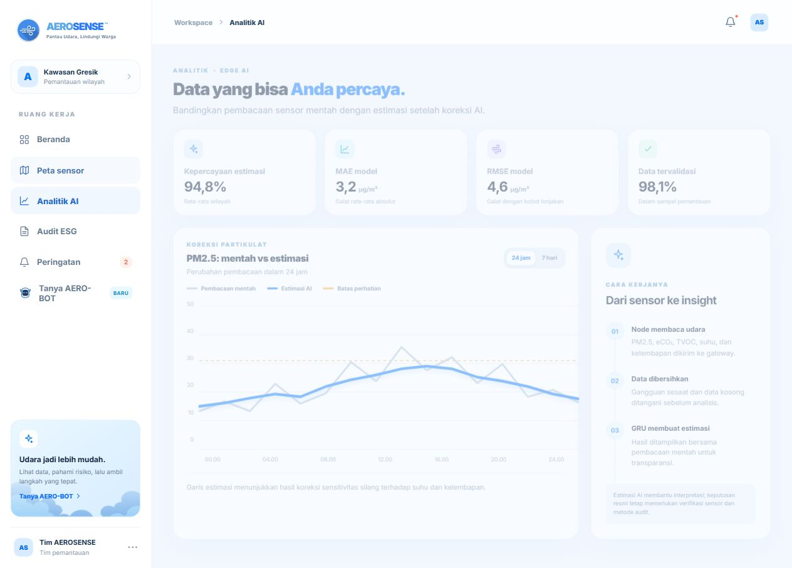
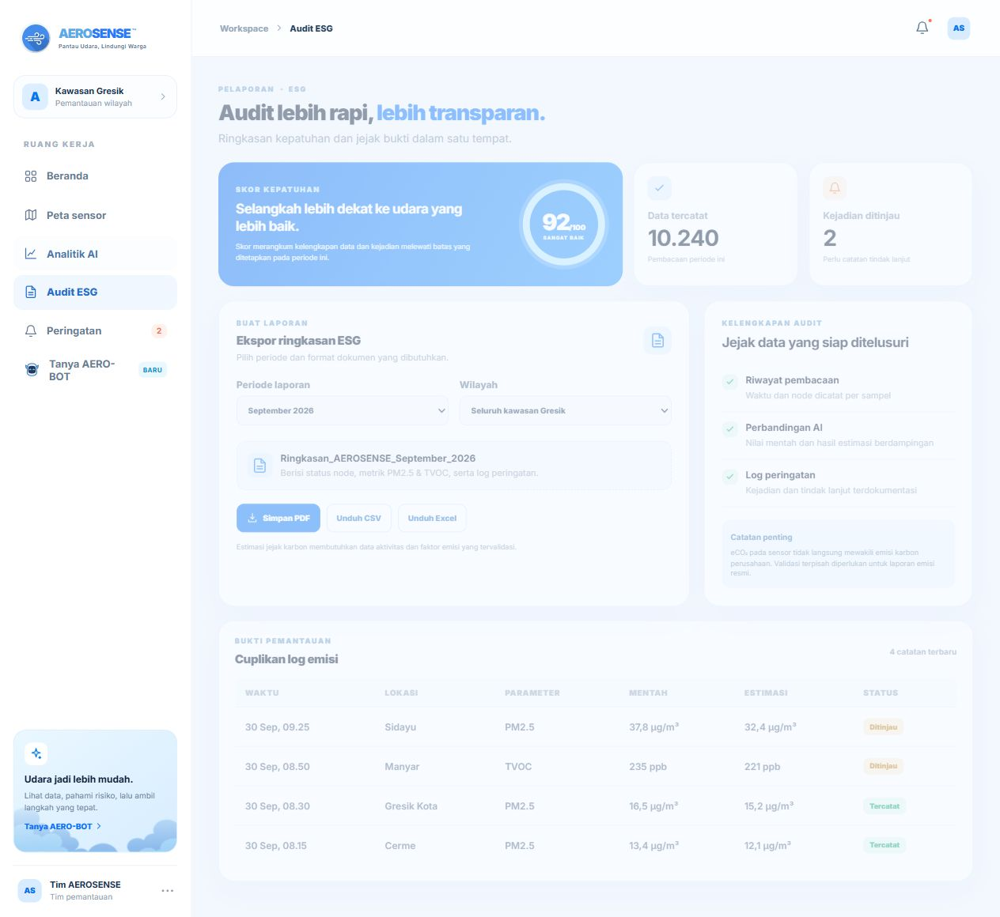
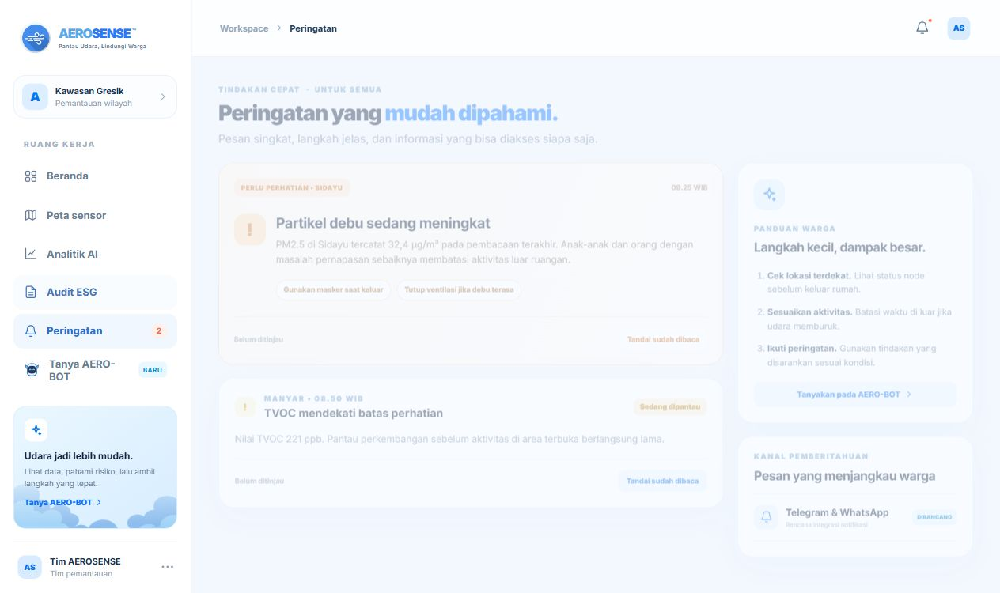
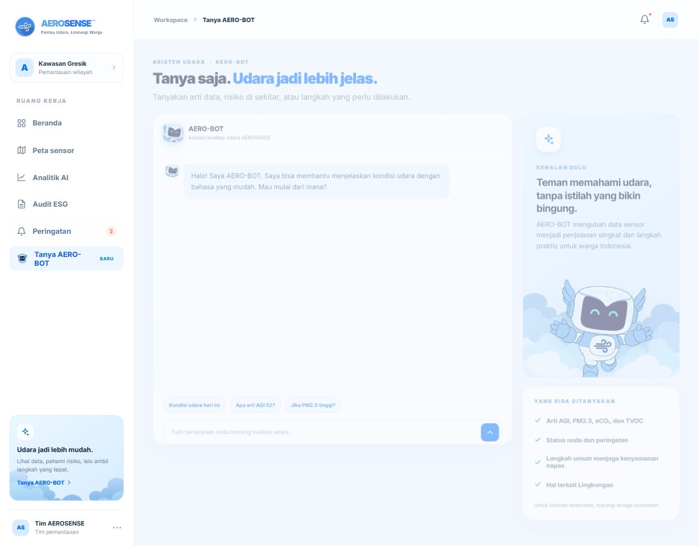

# AEROSENSE

Pantau Udara, Lindungi Warga.

AEROSENSE adalah antarmuka pemantauan kualitas udara untuk kawasan Gresik. Situs ini menyatukan ringkasan AQI, titik sensor, analitik, audit ESG, peringatan, dan bantuan AERO-BOT dalam satu alur kerja berbahasa Indonesia.

Repositori ini berisi implementasi antarmuka. Pembacaan sensor dan laporan yang tampil saat ini masih berupa data contoh. Struktur halaman dan interaksinya sudah dapat dicoba tanpa proses instalasi.

## Menjalankan proyek

Pastikan Python tersedia, lalu jalankan dari direktori repositori:

```bash
python -m http.server 4173
```

Buka [http://localhost:4173](http://localhost:4173). File utama berada di direktori akar, sehingga halaman juga dapat dibuka langsung melalui `index.html`. Server lokal lebih disarankan agar perilaku aset dan unduhan konsisten.

## Halaman

### Beranda

Ringkasan kondisi kawasan, AQI rata-rata, metrik utama, peta singkat, saran harian, dan peringatan terbaru.



### Peta sensor

Sepuluh titik pemantauan contoh di kawasan Gresik. Pilih titik pada peta atau tabel untuk melihat metriknya, lalu saring daftar berdasarkan status.



### Analitik AI

Perbandingan pembacaan mentah dan estimasi koreksi, pilihan rentang waktu, serta ringkasan performa model yang dirancang untuk alur analitik.



### Audit ESG

Ringkasan indikator, cuplikan log pemantauan, pilihan periode, dan ekspor laporan contoh.



### Peringatan

Peringatan untuk lokasi yang perlu diperhatikan, tindakan yang mudah diikuti warga, serta status sudah dibaca selama sesi berlangsung.



### Tanya AERO-BOT

Percakapan untuk menjelaskan istilah kualitas udara, status node, dan langkah umum saat kondisi memburuk. Pengguna dapat memilih pertanyaan awal atau mengetik sendiri.



## Struktur repositori

```text
index.html                 Markup enam halaman
styles.css                 Tata letak, komponen, dan responsivitas
dashboard-refinement.css   Penyesuaian Beranda dan elemen visual
app.js                     Navigasi dan interaksi antarmuka
assets/                    Logo, ilustrasi AERO-BOT, dan awan
screenshots/               Tangkapan layar tiap halaman
docs/                      Dokumentasi produk dan implementasi
```

## Batas implementasi saat ini

Node, waktu pembacaan, skor, dan rekomendasi menggunakan data contoh yang ditanam di sisi klien. Peta menggambarkan hubungan lokasi secara visual, bukan koordinat sensor sebenarnya. AERO-BOT memakai jawaban yang disiapkan di `app.js`; Gemini belum terhubung. Ekspor audit berisi catatan contoh dan belum dapat dipakai sebagai bukti audit resmi. Tidak ada akun pengguna, penyimpanan status peringatan, atau pengiriman notifikasi pada versi ini.

Tahap berikutnya adalah mengganti data contoh dengan telemetri yang memiliki sumber dan waktu pembacaan, menambahkan penyimpanan dan hak akses, lalu menghubungkan AERO-BOT ke Gemini melalui server. Kunci API harus disimpan di server.

## Dokumentasi

- [Arsitektur dan alur aplikasi](docs/architecture.md)
- [Sumber data dan batasannya](docs/data.md)
- [Sistem visual dan aset](docs/design-system.md)
- [Cara mengembangkan dan memeriksa situs](docs/development.md)
- Rincian halaman: [Beranda](docs/pages/beranda.md), [Peta sensor](docs/pages/peta-sensor.md), [Analitik AI](docs/pages/analitik-ai.md), [Audit ESG](docs/pages/audit-esg.md), [Peringatan](docs/pages/peringatan.md), dan [Tanya AERO-BOT](docs/pages/aerobot.md)
